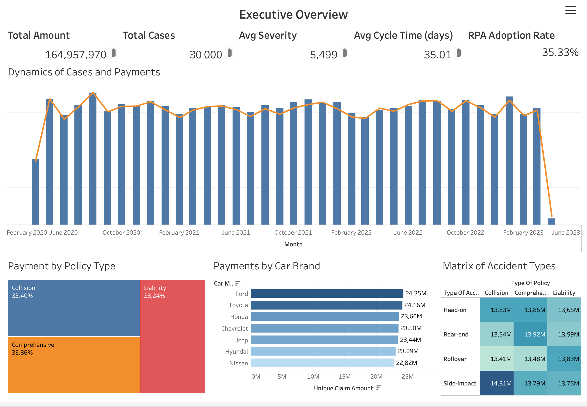
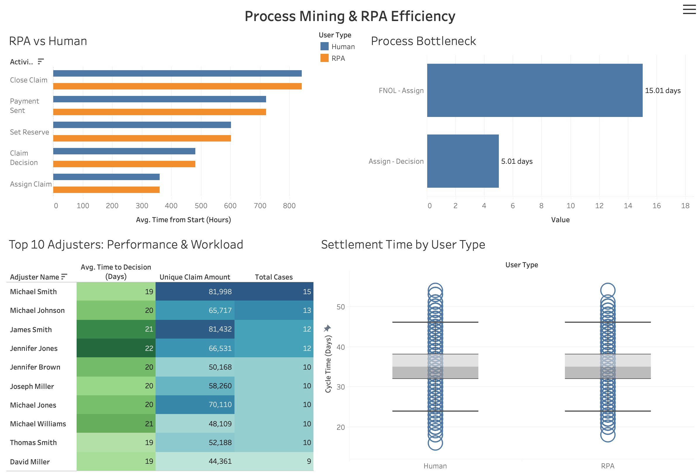
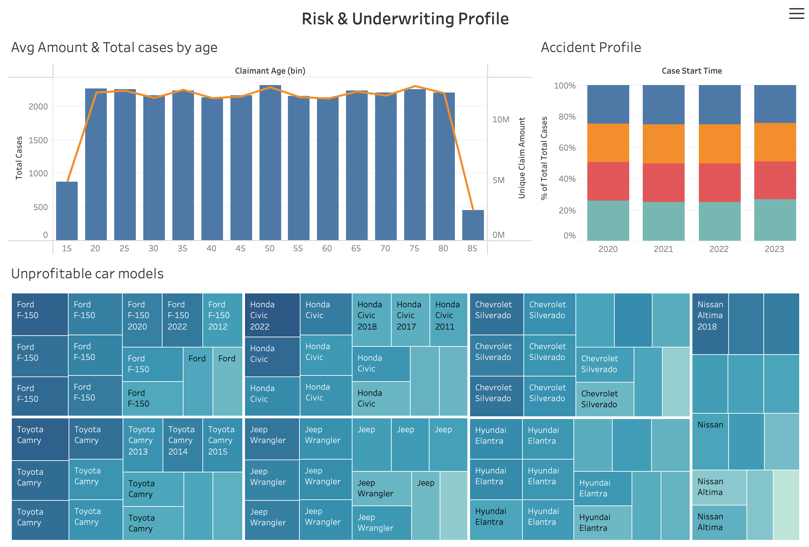

# End-to-End Insurance Process Mining & RPA Efficiency Analytics


An end-to-end analytics project designed to evaluate claims processing efficiency, discover operational bottlenecks, measure Robotic Process Automation (RPA) adoption, and analyze underwriting loss risks for an insurance provider.

---

## Interactive Dashboards

**[View Full Interactive Dashboard on Tableau Public](dashboard/Interactive_Dashboard.md)**

### Dashboard Overviews

#### Page 1: Executive Overview
*High-level KPIs, total payout dynamics, claims by policy type, vehicle brand, and loss matrix.*


#### Page 2: Process Mining & RPA Efficiency
*Bottleneck discovery, lead-time breakdowns, RPA vs. Human process variance, and adjuster performance scorecard.*


#### Page 3: Risk & Underwriting Profile
*Claimant age distribution analysis, loss trends by vehicle model/year, and accident profile dynamics.*


---

## Repository Structure

```text
├── data/
│   └── Insurance_data - Insurance_claims_event_log.csv    # Original claims event log dataset
├── documentation/
│   ├── (EN) End-to-End Insurance Analytics.md             # Full technical documentation in 								     English
│   └── (UA) End-to-End Insurance Analytics.md             # Full technical documentation in 								     Ukrainian
├── dashboard/
│   ├── preview_p1.png                                     # Executive Overview screenshot
│   ├── preview_p2.png                                     # Process Mining & RPA screenshot
│   ├── preview_p3.png                                     # Risk Profile screenshot
│   ├── Interactive_Dashboard.md                           # Link to Tableau Public
│   └── End-to-End Insurance_Analytics.twb                 # Tableau Workbook source file
└── README.md                                              # Project landing page

Strategic Business Objectives
Cycle Time Reduction: Decrease the total duration from claim occurrence (FNOL) to case closure (Close Claim) and identify specific operational bottlenecks across key process stages.

RPA Efficiency Assessment & Optimization: Evaluate the share of automated cases (RPA Adoption Rate) and compare processing speed and stability between Robotic Process Automation (RPA) and human agents across various process steps.

Underwriting Accuracy & Risk Calculation Improvement: Identify the most unprofitable portfolio segments by analyzing claim payout dependencies on driver age, accident types, policy types, vehicle makes, models, and model years.

Adjuster Workload Optimization: Analyze Top Adjuster performance (adjuster_name), compare their workload (case volume), total approved payout amounts, and average time-to-decision.

Executive Control & High-Level Monitoring: Provide C-level management with a single-page overview to track total payouts, total case count, average claim severity, and payout trends over time.

Main Analytical & Technical Tasks
1. Operational Analysis & Process Mining
Calculate total End-to-End SLA (Avg Cycle Time) and individual activity durations (activity_name) in hours and days.

Measure time delays between key process milestones (FNOL -> Assign and Assign -> Decision).

Compare mean and median lead times between RPA and Human processing, and evaluate settlement time distribution (variance) using Box Plots.

2. Financial, Product & Risk Analytics
Calculate total and average payout amounts (Unique Claim Amount) broken down by policy types (type_of_policy) and car brands (car_make).

Build a 2D risk/loss matrix (Heatmap) cross-referencing accident types (type_of_accident) and policy types.

Create a Treemap structure of the most unprofitable car makes and models (car_model), detailed by manufacturing year (car_year).

Examine total case distribution and average claim size across driver age bins (Claimant Age bin).

Evaluate the yearly structure and dynamics of accident types using a 100% Stacked Bar Chart.

3. Workforce Performance Analytics
Construct a performance matrix (Highlight Table) for Top-10 Adjusters (adjuster_name).

Calculate key metrics per adjuster: total processed cases (Total Cases), total approved payouts (Unique Claim Amount), and average speed (Avg. Time to Decision).

Key Findings
Primary Bottleneck: The step from initial notice to adjuster assignment (FNOL -> Assign) takes an average of 15.01 days. This accounts for over 42% of the entire claim cycle (Avg Cycle Time = 35.01 days).

Decision-Making Speed: Once assigned to an adjuster, the Assign -> Decision stage moves significantly faster, taking 5.01 days on average.

RPA Penetration & Stability: The automated case share reached 35.33%. While the median settlement time between RPA and Human processing is virtually identical (~35 days), RPA exhibits significantly fewer extreme time outliers, delivering higher operational consistency.

Adjuster Workload: The Top-10 adjusters handle between 9 and 15 cases each, with average time-to-decision staying within a tight range of 19 to 22 days.

High-Loss Portfolio Segments: The highest cumulative payout amounts stem from high-volume vehicle models (Ford F-150, Toyota Camry, Honda Civic, Chevrolet Silverado). Driver age analysis reveals the largest average claim amounts in the 50–55 and 75–80 age brackets.

Actionable Business Recommendations
Implement Auto-Assignment: Eliminate the primary 15-day FNOL -> Assign bottleneck by automating case assignment via intelligent routing algorithms. This will reduce overall settlement time by 30–40% (down to ~20–22 days).

Refine RPA Decision Rules: Enable Straight-Through Processing (STP) for low-complexity claims (e.g., under $2,000) to auto-approve without systemic delays.

Expand Automation Coverage: Increase RPA Adoption Rate to 50%+ by expanding end-to-end automation over Set Reserve and Payment Sent steps for standard Collision and Comprehensive policies.

Underwriting Rate Adjustments: Increase base rates or deductibles for vehicle models demonstrating the highest cumulative loss ratios (2018–2022 models of Ford F-150, Honda Civic, Toyota Camry).

Tools & Technologies Used
Business Intelligence: Tableau Public

Data Processing: Tableau LOD Calculations

Dataset: Synthetic Event Log for Claims Management Systems (Insurance_claims_event_log.csv)

Documentation: Markdown / Git